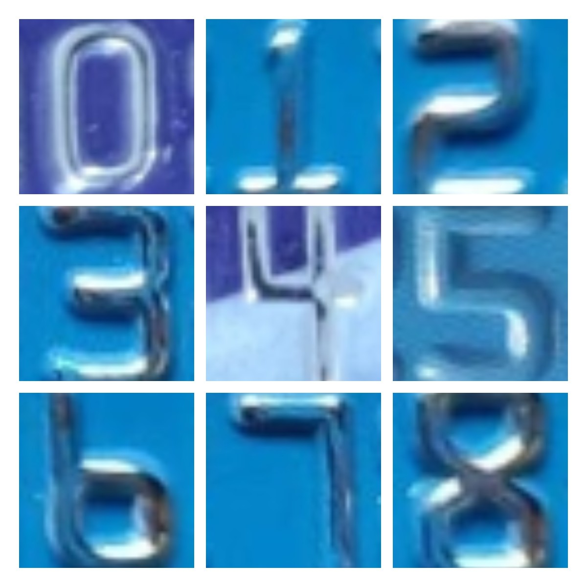

# Bankcard-single-word-dataset
银行卡卡号钢印单字数据集， 可用于字符分类，也可以用于ocr文字识别图像增强

## File
* single-word-images: 单字图像数据集，合计1395张，按照数字类别文件夹存放对应的图片，每类图片数量如下：
    * 0：247
    * 1：195
    * 2：249
    * 3：93
    * 4：79
    * 5：101
    * 6：161
    * 7：73
    * 8：108
    * 9：70 
* labels.txt: image_name, label, 中间使用`\t` 进行分隔
* 样例：

